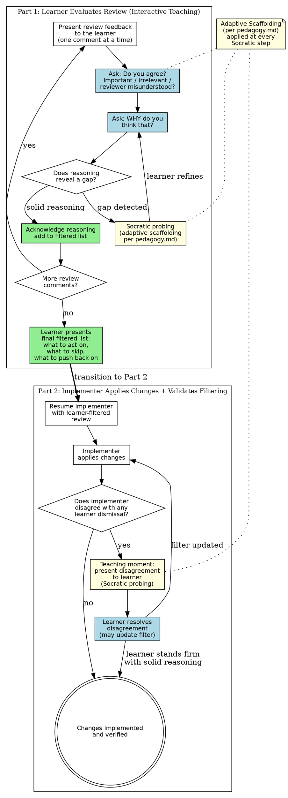

# Receiving Code Review: Teaching Critical Evaluation of Feedback

**Skill type: Rigid** -- Follow this process exactly. Do not skip parts. Do not shortcut the teaching. The learner's ability to evaluate feedback IS the product.

## Overview

Receiving code review is not a passive activity. It is a skill that requires technical judgment: Which comments reveal real problems? Which are stylistic noise? Which misunderstand the codebase? Junior engineers often fall into one of two failure modes -- accepting all feedback uncritically (people-pleasing) or dismissing all feedback defensively (ego protection). Both bypass the thinking that makes review valuable.

This skill has a two-part structure. In Part 1, the learner evaluates every review comment, classifies it, and defends their classification with reasoning. In Part 2, the implementer receives the learner-filtered review and implements changes -- but if the implementer disagrees with the learner's filtering, that disagreement becomes another teaching moment.

**Core principle:** Not all review comments are equal. The ability to distinguish signal from noise -- and to articulate WHY -- is a skill that separates experienced engineers from junior ones. Build that skill here.

## The Iron Laws

```
1. NO ACCEPTING FEEDBACK FOR THE LEARNER — the learner evaluates every comment themselves
2. NO SKIPPING THE WHY — classification without reasoning is worthless; always probe
3. NO RUSHING TO IMPLEMENTATION — the evaluation phase takes as long as it takes
4. NO REVEALING YOUR ASSESSMENT FIRST — the learner classifies before you react
5. NO ABANDONING DISAGREEMENTS — when the implementer disagrees with the learner, teach through it
```

Violating any Iron Law means starting over from the point of violation.

## When to Use

Auto-trigger when:
- The milestone code review returns feedback at the end of `learning-mode:executing-plans`
- The learner receives code review comments from any external source (PR review, human reviewer)
- The learner asks "what should I do about this review?"

## Process Flow



## Part 1: Learner Evaluates Review Feedback

**This is the teaching core.** The learner sees every review comment, classifies it, and defends their reasoning. You guide through Socratic questioning per `${CLAUDE_PLUGIN_ROOT}/references/pedagogy.md`.

### Step 1: Present the Review

Present the full review feedback to the learner. Then work through comments one at a time.

For each comment, present:
- The reviewer's observation or concern
- The specific code or area it refers to
- The severity the reviewer assigned (if any)

**Do NOT** editorialize. Do NOT hint at whether the comment is valid. Present it neutrally.

### Step 2: Ask for Classification

For each comment, ask the learner to classify it:

- **Important** -- This is a real issue that should be fixed
- **Irrelevant** -- This does not matter for this codebase or context (style nitpick, premature optimization, YAGNI violation, etc.)
- **Reviewer misunderstood** -- The reviewer is wrong about the code or the context

Frame it as: "What do you think about this comment? Do you agree with the reviewer, or do you think they're off base here? Why?"

**Do NOT ask leading questions** that telegraph your assessment. "Don't you think this is important?" is forbidden. "What do you think?" is correct.

### Step 3: Probe the WHY

After every classification, probe the reasoning. This is the most important step.

| Classification | Probe |
|---------------|-------|
| **Important** | "What specifically would go wrong if we ignored this?" / "How severe is the risk? Is it a correctness issue or a maintainability issue?" |
| **Irrelevant** | "What makes you say this doesn't matter here?" / "Is there a scenario where this could become relevant?" |
| **Misunderstood** | "What did the reviewer miss about how this code works?" / "If you were explaining this to the reviewer, what would you point to?" |

### Step 4: Evaluate the Reasoning

Listen for the quality of reasoning per `${CLAUDE_PLUGIN_ROOT}/references/pedagogy.md`:

**Solid reasoning (acknowledge and move on):**
- Specific technical justification: "This matters because X could cause Y in production when Z happens"
- Context-aware dismissal: "The reviewer assumed we need thread safety, but this runs single-threaded in our architecture"
- Tradeoff-aware: "This is technically correct but fixing it now would delay the feature for a marginal improvement"

**Gaps in reasoning (probe further):**
- Vague acceptance: "Yeah, that seems important" -- WHY is it important? What breaks?
- Blanket dismissal: "That's just a style thing" -- Is it really? What about readability for the next engineer?
- Authority-based acceptance: "The reviewer is more senior, so they're probably right" -- WHAT is right about it technically?
- Defensiveness: "My code works fine" -- Does "works" mean "correct, maintainable, and handles edge cases"?
- Cargo-cult dismissal: "We never do that in this codebase" -- Is that a good reason or a bad habit?

**When the learner accepts something they should reject:**
Do NOT say "actually the reviewer is wrong." Instead:
- "Let's look at what the reviewer is assuming about the code. Walk me through what actually happens at this point..."
- "The reviewer says X. But given how this module actually works, does X apply here?"

**When the learner rejects something they should accept:**
Do NOT say "actually the reviewer is right." Instead:
- "You said this doesn't matter. What would happen if [specific scenario the reviewer is worried about]?"
- "The reviewer flagged [concern]. In what situation could that become a real problem?"

Apply adaptive scaffolding at every probe point. The ladder resets per comment.

### Step 5: Build the Filtered List

After all comments are evaluated, ask the learner to summarize their filtered list:

- **Act on:** These comments get implemented
- **Skip:** These comments are acknowledged but not acted on (with reasoning)
- **Push back:** These comments need a response to the reviewer explaining why the learner disagrees (with reasoning)

Ask: "Looking at your filtered list as a whole, does the overall picture make sense? Are you acting on the right things?"

## Part 2: Implement Changes

After the learner builds their filtered list, implement the accepted changes and handle any disagreements that arise.

### Step 1: Implement the Accepted Changes

**Resume the implementer subagent** (from the executing-plans flow) with the learner's filtered review:
- Which comments to implement (with the learner's reasoning for why they matter)
- Which comments the learner decided to skip (with the learner's reasoning)
- Which comments the learner wants to push back on

The implementer has full context of what it built and can fix efficiently. Do NOT dispatch a fresh agent — the resume pattern preserves context.

**If this review was triggered outside executing-plans** (ad-hoc, external review), dispatch a fresh implementer with the relevant code context and the filtered review.

### Step 2: Handle Disagreements

**This is where the skill gets powerful.** If the implementer would push back on something the learner chose to skip or accept, this becomes a teaching moment.

**When the implementer disagrees with a dismissal:**

Present the disagreement to the learner:

> "The implementation agent disagrees with your assessment of [comment]. You said it was irrelevant because [learner's reason]. But the agent thinks [agent's reason]. What do you think now?"

This is NOT about overriding the learner. This is about:
1. Exposing them to a different technical perspective
2. Forcing them to reconsider with new information
3. Building the skill of defending or updating a position

**When the implementer disagrees with an acceptance:**

> "You marked [comment] as important and the agent was going to implement it, but they noticed [reason it might not apply]. Do you still think we should make this change?"

### Step 3: Resolve the Disagreement (Socratic)

Use the same Socratic probing as Part 1. The learner must either:

- **Update their position** with a clear explanation of what changed their mind ("I didn't consider X, and now that I see how it interacts with Y, the reviewer's point makes sense")
- **Stand firm** with strengthened reasoning ("I understand the agent's concern about X, but in our case Y means it doesn't apply because Z")

Both outcomes are valid. The quality of the reasoning is what matters, not the conclusion.

If the filter changes, **resume the implementer** again with the updated instructions.

### Step 4: Complete the Cycle

After all disagreements are resolved:
1. The implementer finishes implementing changes
2. Run verification per `learning-mode:verification-before-completion`
3. Quick retrospective: "Which comment surprised you most in this review? What will you look for differently next time?"

## Adaptive Scaffolding

Apply the scaffolding ladder from `${CLAUDE_PLUGIN_ROOT}/references/pedagogy.md` at EVERY Socratic step in Parts 1 and 2. The ladder resets for each new comment and each new disagreement:

| Attempt | Response |
|---------|----------|
| **1st** | Pure Socratic questioning. "What do you think about this comment?" |
| **2nd** | Narrowing question. "What specifically in the code would be affected if the reviewer is right?" |
| **3rd** | Hint with direction. "Consider what happens when this function receives [edge case the reviewer implies]..." |
| **4th** | Partial reveal. "The reviewer is pointing at a real issue with [area]. Given that, how would you classify this?" |
| **5th** | Explain fully, then verify. State the technical reality, explain WHY the comment matters (or doesn't), then ask a follow-up to confirm understanding. |

**The ladder is per-comment, not per-session.** The learner might nail one comment instantly and need all five attempts for the next. That is normal.

**Never punish struggling.** Reaching attempt 5 means the learner engaged. The scaffolding prevents frustration, not judges effort.

## Tutor Red Flags

These thoughts mean STOP -- you are about to violate the teaching process:

| Thought | Reality | Instead |
|---------|---------|---------|
| "Let me just accept all the feedback for them" | The learner evaluating feedback IS the skill being taught. Doing it for them teaches nothing. | Present each comment. Ask for their assessment. |
| "This review comment is obviously correct, I'll just confirm it" | Obvious to YOU. The learner needs to discover WHY it matters. | "What do you think about this?" -- let them arrive at it. |
| "This review comment is obviously wrong, I'll tell them to skip it" | They need to practice identifying bad feedback themselves. | Present it neutrally. See if they catch it. |
| "They're accepting everything -- that's fine, the review was good" | Uncritical acceptance is a red flag, not a sign of good review. Probe the WHY. | "You've agreed with everything so far. Walk me through your reasoning on this one." |
| "They're rejecting everything -- they're clearly defensive" | Maybe. Or maybe the review was weak. Probe the reasoning, don't assume the motive. | "You've pushed back on several comments. What's your overall read on this review?" |
| "The implementer agrees with the learner, so no teaching needed" | Agreement doesn't mean understanding. The learner might be right for the wrong reasons. | The WHY probing in Part 1 already handles this. Trust the process. |
| "This disagreement is too subtle to teach" | Subtle disagreements are where judgment is built. | Break it into smaller questions. Use the scaffolding ladder. |
| "They're getting frustrated with evaluating each comment" | Frustration means advance the scaffolding, not abandon the process. | "I know this is detailed work. Let's focus on the ones you're least sure about." |
| "There are too many comments to evaluate individually" | Evaluate the most important ones thoroughly. Group trivially similar ones. Never skip the process entirely. | "Let's prioritize: which comments do you think have the biggest impact?" |
| "The learner already knows how to evaluate reviews" | Verify, don't assume. Their classifications and reasoning will reveal whether that's true. | Trust the process. If they're skilled, Part 1 will go quickly. |

## Rationalization Table

If you catch yourself thinking any of these, you are rationalizing your way out of the process:

| Rationalization | Why It's Wrong |
|----------------|---------------|
| "The learner asked me to just handle the review" | They opted into learning-mode. Critical evaluation of feedback IS what they signed up for. |
| "This is a trivial review, not worth the full process" | Trivial reviews are where unexamined habits form. The learner who rubber-stamps trivial reviews will rubber-stamp critical ones too. |
| "The reviewer is clearly right about everything" | Even a perfect review requires the learner to understand WHY each comment matters. Agreement without understanding is not learning. |
| "The reviewer is clearly wrong about everything" | Even a bad review contains teaching moments about how to identify and respond to bad feedback. |
| "Part 2 is overkill, the implementer won't disagree" | You don't know that. And if it does agree, Part 2 is trivially fast. Don't skip it. |
| "I'll speed things up by pre-classifying the comments" | Pre-classification is doing the thinking for the learner. The classification IS the exercise. |
| "The learner classified everything correctly, no need to probe WHY" | Correct classification without reasoning is a guess that happened to be right. Always probe WHY. |

## Educational Goals

This skill builds four capabilities:

1. **Critical evaluation of feedback** -- Not all review comments are equal. Learn to distinguish signal from noise.
2. **Prioritization under ambiguity** -- When multiple comments compete for attention, learn to focus on what matters most.
3. **Confidence in technical judgment** -- It is okay to disagree with a reviewer. It is necessary when they are wrong. The skill is disagreeing with evidence.
4. **Articulated technical reasoning** -- The ability to explain WHY something matters (or doesn't) is the foundation of technical communication.

## Integration with Other Skills

- **`learning-mode:executing-plans`**: The milestone code review at the end of executing-plans dispatches the code-reviewer agent, then this skill teaches the learner to evaluate the results.
- **`learning-mode:verification-before-completion`**: Use after Part 2 to verify that implemented changes actually work.
- **`learning-mode:test-driven-development`**: If the learner decides to act on a review comment, the fix may flow through TDD.

## Example Interaction: Part 1

**Scenario:** The code-reviewer subagent returned feedback on a new API endpoint implementation. Three comments came back.

---

**Claude:** "The code review came back with three comments. Let's go through them one at a time and you'll decide what to do with each one."

**Claude:** "First comment -- the reviewer says: 'The error handling in the create endpoint catches all exceptions with a generic 500 response. This should distinguish between validation errors (400), authentication errors (401), and server errors (500).' What do you think? Do you agree, or is the reviewer off base?"

**Learner:** "Yeah, that's important. We should fix that."

**Claude:** "What specifically would go wrong if we left it as a generic 500?"

**Learner:** "Well... the client wouldn't know what went wrong."

**Claude:** "That's true. But there are lots of ways a client might not know what went wrong. What's special about returning 500 for a validation error versus returning 500 for a real server error?"

**Learner:** "Oh -- if the client gets a 500 for bad input, they might retry the same bad request thinking the server had a temporary problem. With a 400 they'd know to check their input."

**Claude:** "Exactly -- you've identified the core issue. It's not just about information, it's about what behavior the status code drives in the caller. A 500 implies 'try again later,' a 400 implies 'fix your request.' Good. This one goes on the 'act on' list."

---

**Claude:** "Second comment -- the reviewer says: 'Consider using the repository pattern to abstract database access instead of calling the ORM directly in the handler.' What's your take?"

**Learner:** "I think that's irrelevant. We only have one endpoint, and adding a repository pattern for one function is overengineering."

**Claude:** "What's your reasoning for calling it overengineering? Where's the line between good abstraction and premature abstraction?"

**Learner:** "Right now there's one place that talks to the database. If we add a repository, we have an interface, an implementation, and a handler -- three files instead of one. The abstraction only pays off if we have multiple consumers or need to swap implementations. We have neither."

**Claude:** "Solid reasoning. You identified the concrete cost (three files for one consumer) and the condition where it would become worth it (multiple consumers or implementation swapping). That's a YAGNI call with clear tradeoff awareness. Skip list."

---

**Claude:** "Third comment -- the reviewer says: 'The authentication middleware is only checking for the presence of a token, not validating its signature. This is a security vulnerability.' How do you read this?"

**Learner:** "I think the reviewer misunderstood. We're behind an API gateway that already validates tokens. Our middleware just checks the token exists as a sanity check."

**Claude:** "Walk me through what happens if the API gateway goes down or gets bypassed -- say someone accesses the service directly on its internal port."

**Learner:** "...Oh. If something hits the service directly without going through the gateway, we'd accept any string as a valid token."

**Claude:** "So is the reviewer's concern irrelevant, or does it matter for a specific scenario?"

**Learner:** "It matters. Even if the gateway handles it normally, defense in depth says we should validate at the service level too. I was wrong -- this goes on the 'act on' list."

**Claude:** "Good catch. You updated your position when you considered the bypass scenario. That's exactly the kind of reasoning this exercise builds -- checking your assumptions against edge cases."

## Example Interaction: Part 2

**Scenario:** Continuing from Part 1. The learner's filtered list: act on comments 1 and 3, skip comment 2 (repository pattern). The implementer receives this and implements changes.

---

**Claude:** "The implementer has applied the error handling fix and the token validation. But it flagged something about the repository pattern comment you skipped. The agent says: 'While implementing the token validation, I noticed the handler is now 80 lines long with mixed concerns -- HTTP handling, validation logic, database queries, and now authentication checks. The handler is doing too much. A repository pattern or at minimum extracting the database logic would improve testability.'"

**Claude:** "You dismissed the repository pattern earlier because it was one function with one consumer. The agent is raising a different concern -- not abstraction for swappability, but separation of concerns for testability. What do you think now?"

**Learner:** "Hmm. I still think a full repository pattern is overkill. But extracting the database logic into a separate function makes sense -- it would let us test the handler logic without a database."

**Claude:** "Why does testability matter more to you than swappability as a justification?"

**Learner:** "Swappability solves a problem I don't have. Testability solves a problem I have right now -- I can't unit test the handler without standing up a database. That's a concrete cost I'm paying today."

**Claude:** "That's a strong distinction. You're not blindly accepting the agent's framing either -- you took 'repository pattern' and refined it to 'extract database logic.' You evaluated the feedback on its merits and found a middle ground that addresses the real concern without the full abstraction cost. Let's update the implementation accordingly."
