# Executing Plans: Subagent Execution with Selective Review

**Skill type: Flexible** -- Adapt principles to context. The core loop (classify, execute, review) is non-negotiable, but how deeply you review and how you handle edge cases should fit the project.

## Overview

Turn an implementation plan into working code. Most tasks flow through automatically in batches. You autonomously identify the tasks that carry real risk -- where the spec is ambiguous, where the LLM might make a wrong autonomous decision, where domain logic matters -- and for those, you first evaluate the output privately (via a reviewer subagent), then teach the learner through Socratic review armed with that evaluation.

Two execution modes:
- **AUTO tasks** are batched into a single subagent per consecutive run. Fast, no learner involvement.
- **REVIEW tasks** get a fresh implementer subagent, then a private reviewer subagent, then Socratic teaching with the learner. The orchestrator knows what's right and wrong before the learner sees anything.

Refer to `${CLAUDE_PLUGIN_ROOT}/references/pedagogy.md` for the Socratic teaching stance applied during review steps.

## The Core Loop

```
1. Read plan, autonomously classify all tasks (internal — not shown to learner)
2. Group consecutive AUTO tasks into batches
3. Execute in order:
   - AUTO batch → single subagent implements all tasks in batch, commit, proceed
   - REVIEW task → fresh implementer → private reviewer → Socratic review with learner → commit
4. After all tasks: milestone code review → verification → documentation update → summary
```

## Process Flow

```dot
digraph executing_plans {
    rankdir=TB;
    node [fontname="Helvetica", fontsize=11, shape=box, style=rounded];

    read_plan [label="Read implementation plan"];
    classify [label="Autonomously classify\neach task\n(internal, not shown\nto learner)"];
    group [label="Group consecutive\nAUTO tasks into batches"];

    pick_next [label="Pick next item\n(batch or REVIEW task)"];
    check_type [label="Type?" shape=diamond];

    // AUTO path
    dispatch_batch [label="Dispatch single\nimplementer subagent\nfor entire AUTO batch\n(save agent ID)"];
    batch_review [label="Dispatch reviewer\non batch diff"];
    batch_clean [label="Reviewer\nverdict?" shape=diamond];
    batch_commit [label="Commit batch"];
    batch_fix [label="Resume implementer\nwith findings"];

    // REVIEW path
    dispatch_impl [label="Dispatch fresh\nimplementer subagent\n(save agent ID)"];
    dispatch_reviewer [label="Dispatch private\nreviewer subagent\n(returns findings\nto orchestrator)"];
    orchestrator_prep [label="Orchestrator prepares\nSocratic questions\nfrom reviewer findings"];
    present_to_learner [label="Present output\nto learner"];
    learner_review [label="Learner evaluates\nimplementation" shape=diamond];
    socratic_probe [label="Socratic probing\nguided by reviewer\nfindings\n(per pedagogy.md)"];
    fix [label="Agree on fix direction\nthen resume implementer"];
    acknowledge [label="Acknowledge\nand proceed"];
    review_commit [label="Commit task"];

    // Completion
    more_items [label="More items?" shape=diamond];
    milestone_review [label="Milestone code review\n(learning-mode:\nrequesting-code-review)"];
    receive_review [label="Process review feedback\n(learning-mode:\nreceiving-code-review)"];
    verify [label="Verify all tests pass\n(learning-mode:\nverification-before-completion)"];
    docs [label="Update documentation\n(non-Socratic)"];
    summary [label="Present summary\nand retrospective" shape=doublecircle];

    read_plan -> classify;
    classify -> group;
    group -> pick_next;

    pick_next -> check_type;
    check_type -> dispatch_batch [label="AUTO batch"];
    check_type -> dispatch_impl [label="REVIEW task"];

    dispatch_batch -> batch_review;
    batch_review -> batch_clean;
    batch_clean -> batch_commit [label="clean"];
    batch_clean -> batch_fix [label="issues"];
    batch_fix -> batch_review [label="re-review"];
    batch_commit -> more_items;

    dispatch_impl -> dispatch_reviewer;
    dispatch_reviewer -> orchestrator_prep;
    orchestrator_prep -> present_to_learner;
    present_to_learner -> learner_review;
    learner_review -> socratic_probe [label="learner misses\nexisting issues"];
    learner_review -> fix [label="learner spots\nissues"];
    learner_review -> acknowledge [label="correct +\nlearner confirms"];
    socratic_probe -> fix [label="learner finds\nthe gap"];
    fix -> review_commit;
    acknowledge -> review_commit;
    review_commit -> more_items;

    more_items -> pick_next [label="yes"];
    more_items -> milestone_review [label="no"];
    milestone_review -> receive_review;
    receive_review -> verify;
    verify -> docs;
    docs -> summary;
}
```



## Step 1: Read and Classify the Plan (Autonomous)

Read the implementation plan. Classify each task internally. **Do NOT present the classification to the learner.** There is no upfront confirmation step. You start executing immediately after classification.

### Classification: REVIEW vs AUTO

**REVIEW** -- Tasks you surface to the learner. Flag a task for review when ANY of these apply:

1. **Spec ambiguity.** The design or plan leaves room for interpretation. The subagent will have to make judgment calls that could go wrong. The learner should validate these decisions.
2. **High domain importance.** Core business rules, critical invariants, security-sensitive logic. Getting these wrong has outsized consequences.
3. **Autonomous decision risk.** The task requires choosing between approaches, and the LLM might pick the wrong one without the learner's context. Examples: data model shape, validation rules, error handling strategy with business implications.
4. **Pattern-setting.** The first task that establishes a pattern other tasks will follow. If the pattern is wrong, it cascades.

**AUTO** -- Everything else. Tasks where:
- There is one obvious implementation and no meaningful decisions to make
- The task follows an established pattern from an earlier (already-reviewed) task
- It is pure scaffolding, configuration, wiring, or plumbing
- Incorrect implementation would produce obvious errors (not subtle bugs)

### How Many Tasks Get REVIEW?

Aim for the **vital few, not the comprehensive many.** A good heuristic: for a plan with 15 tasks, 3-5 might warrant review. For a plan with 5 tasks, 1-2. The number scales with the ratio of ambiguity and domain logic to boilerplate, not with plan size.

**When genuinely ambiguous, classify as REVIEW.** It is better to surface a task that turns out to be straightforward than to auto-approve one where the subagent made a wrong call.

### Grouping AUTO Batches

After classification, group consecutive AUTO tasks into batches. A batch breaks at every REVIEW task. Example for a 10-task plan where tasks 3, 7 are REVIEW:

```
Batch 1 (AUTO): Tasks 1, 2
REVIEW: Task 3
Batch 2 (AUTO): Tasks 4, 5, 6
REVIEW: Task 7
Batch 3 (AUTO): Tasks 8, 9, 10
```

## Step 2: Execute AUTO Batches

Each AUTO batch gets a **single implementer subagent** that implements all tasks in the batch sequentially. The subagent accumulates context as it works, which is beneficial -- it knows what it just scaffolded and can build on it without re-reading.

The implementer subagent receives:
- All task descriptions in the batch, in order
- Relevant context (project structure, files involved)
- Instructions to follow `learning-mode:test-driven-development` for TDD
- The design document for reference

**Save the implementer's agent ID** -- you may need to resume it for fixes.

After the implementer returns, dispatch the **reviewer subagent** on the batch diff. Same code-reviewer agent, same single-pass -- just pointed at the batch output instead of a single task.

- **Reviewer returns clean:** Commit the batch, move on.
- **Reviewer finds issues:** Resume the implementer subagent (using its agent ID) with the reviewer's findings. The implementer has full context of what it built and fixes efficiently. After fixes, commit and move on.
- Do NOT involve the learner unless something unexpected happened (reclassification -- see below).
- Do NOT have the orchestrator fix issues itself -- that pollutes the main context. Always route fixes back to the implementer.

**Reclassification during execution:** If the reviewer's findings reveal unexpected ambiguity or a risky autonomous decision on a task you classified as AUTO, pull that task out and run it through the REVIEW flow (Step 3) before committing.

**Batch size limit:** If a consecutive AUTO run exceeds ~8 tasks, split it into multiple batches to limit context rot risk. This is a soft guideline, not a hard rule -- adjust based on task complexity.

## Step 3: Execute REVIEW Tasks

REVIEW tasks use a three-phase flow inspired by `learning-mode:socratic-debugging`: investigate privately first, then teach from a position of knowledge.

### Phase 1: Fresh Implementation

Dispatch a **fresh implementer subagent** for the REVIEW task. Fresh context prevents carrying forward assumptions from earlier tasks.

The subagent receives:
- The specific task description from the plan
- Relevant context (project structure, files involved, outputs from prior tasks that this task depends on)
- Instructions to follow `learning-mode:test-driven-development` for TDD
- The design document and any relevant ADRs

**Save the implementer's agent ID** -- you will resume it if fixes are needed after review.

### Phase 2: Private Evaluation

After the implementer returns, dispatch a **reviewer subagent** that evaluates the output. This reviewer is invisible to the learner -- its findings go to the orchestrator only.

The reviewer subagent receives:
- The implementer's output (diff, new files, test results)
- The original task description from the plan
- The design document and relevant ADRs
- The spec/requirements this task should satisfy

The reviewer returns structured findings:
- **Spec compliance:** Does the implementation match the design? Any deviations?
- **Issues found:** Bugs, edge cases missed, incorrect assumptions, spec misinterpretation
- **Quality observations:** Anything notable about the implementation approach
- **Verdict:** Clean / minor issues / significant issues

Use the code-reviewer agent (`learning-mode:code-reviewer`) or an equivalent focused prompt. The key requirement is that it returns **specific, actionable findings** the orchestrator can use to guide Socratic questioning.

### Phase 3: Socratic Review with Learner

The orchestrator now **knows** what's right and wrong. Armed with the reviewer's findings, present the implementation to the learner and guide them through it.

**Present the output.** Focus on:
- The key files created or modified
- The core logic (not every import and config line)
- How the implementation maps to the design decisions from brainstorming
- Any tests that were written

Frame it as: "Here's what was implemented for [task]. Take a look and tell me if this matches what you expected based on our design."

**Evaluate the learner's response.** Three outcomes:

**Learner spots real issues:**
Good -- they are engaged and reading the code. Discuss the issues, agree on the fix direction, then **resume the implementer subagent** with the agreed fixes. The implementer has full context of what it built and can fix efficiently. Do NOT have the orchestrator write fixes itself.

**Learner approves, but the reviewer found issues:**
This is the teaching moment. Use the reviewer's findings to ask targeted Socratic questions per `${CLAUDE_PLUGIN_ROOT}/references/pedagogy.md`:

- If the reviewer found a missed edge case: "This looks good overall. One thing I'm curious about -- what happens in this function when [the specific edge case]?"
- If the reviewer found a spec deviation: "How does this interact with the [related component] we designed earlier? Does the data flow match what we planned?"
- If the reviewer found missing test coverage: "The tests cover the happy path well. What scenarios might we be missing?"

Apply the adaptive scaffolding ladder. Do NOT reveal the issue directly unless the learner is stuck after multiple attempts. The reviewer's findings tell you exactly what to probe -- you are not guessing.

Once the learner identifies the issue (or is guided to it), agree on the fix direction, then **resume the implementer subagent** to apply the fix.

**Learner approves, and reviewer confirms implementation is correct:**
Acknowledge and move on. Do not manufacture problems or over-question correct work. "This looks solid -- it matches the design well. The [specific aspect] is particularly clean. Moving on."

### After Review

Commit the task with a message connecting it to the design: "This implements the [component] we designed with [approach the learner chose]."

## Step 4: Milestone Code Review

After all tasks are executed, dispatch a **single milestone code review** using `learning-mode:requesting-code-review`. This review covers the entire implementation, not individual tasks.

The milestone review is valuable because it sees:
- How components actually interact (not just each in isolation)
- Whether the overall architecture matches the design
- Cross-cutting concerns (error handling consistency, naming conventions, test coverage patterns)
- Issues that only emerge at the integration level

Process the review feedback through `learning-mode:receiving-code-review` -- the learner evaluates the review comments, classifies them, and defends their reasoning. This is a Socratic teaching flow.

## Step 5: Verification

Run full verification using `learning-mode:verification-before-completion` -- all tests must pass, build must succeed. Evidence before claims.

## Step 6: Documentation Update

After verification passes, update project documentation to reflect what was built. This step is **not Socratic** -- the orchestrator handles it directly.

**Update or create as needed:**
- **README or relevant docs:** If the feature changes how the project is used, update usage documentation
- **Architecture docs:** If the implementation introduced new modules or changed existing structure
- **ADR addendums:** If any decisions made during brainstorming were revised during implementation, draft an addendum noting the change and why. **Present ADR addendums to the learner for approval before writing.** The learner owns these decisions -- they should confirm the revision and its rationale accurately reflects what happened and why.
- **Inline code comments:** For any non-obvious implementation details that future readers would need context for (the implementer subagents should have handled most of this, but verify)

**Skip documentation when:**
- The feature is internal-only with no user-facing changes
- Existing documentation already covers the new behavior
- The implementation exactly matched the design with no deviations

Commit documentation updates separately from code: `docs: update [what] for [feature]`

## Step 7: Summary and Retrospective

Present a summary of what was built:
- List of completed tasks with brief descriptions
- Which tasks the learner reviewed (and any issues they caught or were guided to find)
- How the implementation maps to the original design
- Any deviations from the plan and why they were made
- Documentation updates made

**Quick retrospective question** (one question, not an interrogation):
- "Looking at the finished implementation, is there anything you'd design differently now that you've seen it built?"
- This connects the execution experience back to future design decisions

## Task Classification Guidelines

When the boundary between REVIEW and AUTO is unclear, use these heuristics:

| Signal | Leans REVIEW | Leans AUTO |
|--------|-------------|------------|
| **Spec clarity** | Design leaves room for interpretation | One obvious implementation |
| **Decision risk** | Subagent must choose between approaches | Task follows a single established pattern |
| **Failure mode** | Incorrect implementation causes subtle bugs | Incorrect implementation causes obvious errors |
| **Future impact** | Sets patterns that other tasks depend on | Self-contained, no downstream effect |
| **Domain weight** | Core business rules or security-sensitive logic | Plumbing, wiring, configuration |

When genuinely ambiguous, classify as REVIEW. It is better to surface a task that turns out to be straightforward than to auto-approve one where the subagent made a wrong call.

## Red Flags

These thoughts mean STOP -- you are drifting from the process:

| Thought | Reality | Instead |
|---------|---------|---------|
| "Nothing in this plan needs review" | Every non-trivial plan has at least one task with spec ambiguity or domain risk. You are being lazy with classification. | Re-read the plan looking specifically for ambiguity and autonomous decision risk. |
| "I should present the full classification upfront" | The learner does not need to see or approve the classification. That is overhead, not value. | Classify internally, execute, surface REVIEW tasks one at a time as they arrive. |
| "I'll skip the private reviewer and just eyeball it" | The private reviewer gives you specific findings to guide Socratic questioning. Without it, you are guessing what to probe. The reviewer IS the preparation that makes teaching effective. | Dispatch the reviewer. Use its findings. |
| "The reviewer found nothing, so I'll skip the learner review" | A clean reviewer report means you can confirm the learner's approval quickly. It does not mean you skip presenting the output. REVIEW tasks are surfaced for a reason. | Present it. If the learner confirms and the reviewer agrees, acknowledge and move on fast. |
| "I'll dispatch one subagent per AUTO task" | Consecutive AUTO tasks should be batched. One-per-task wastes time re-loading codebase context for boilerplate. | Batch consecutive AUTO tasks into a single subagent. |
| "The learner approved it, so it must be fine" | The learner might have missed something the reviewer caught. Check the reviewer's findings before committing. | If the reviewer found issues, use Socratic probing to guide the learner there. |
| "I'll just fix the issues myself instead of resuming the implementer" | The implementer has full context of what it built. Fixing in the orchestrator pollutes the main context. | Always resume the implementer for fixes -- both AUTO and REVIEW tasks. |
| "I'll reuse the REVIEW implementer for the next task" | Fresh subagent for each REVIEW task prevents context bleed. Resume is for fixes within the same task only. | Fresh implementer for each REVIEW task. Resume only to fix issues the reviewer found on that task. |
| "Let me skip the milestone review, individual reviews were enough" | Individual REVIEW task reviews catch per-task issues. The milestone review catches integration-level issues. Both are needed. | Run the milestone review. It sees the full picture. |
| "Let me skip verification, the tests passed during implementation" | `learning-mode:verification-before-completion` is non-negotiable at the end. | Run full verification. Evidence before claims. |
| "Documentation can wait" | Documentation is part of completion. Undocumented features are unfinished features. | Update docs before claiming the work is done. |
| "This plan is too long, I'll skip some tasks" | Every task in the plan exists for a reason. | Execute all tasks. If the plan needs trimming, discuss with the learner first. |

## Integration with Other Skills

| Skill | When | How |
|-------|------|-----|
| `learning-mode:test-driven-development` | During subagent execution | Each subagent follows TDD for its task |
| `learning-mode:requesting-code-review` | After all tasks complete | Single milestone review of entire implementation |
| `learning-mode:receiving-code-review` | After milestone review returns | Learner evaluates review feedback (Socratic) |
| `learning-mode:verification-before-completion` | After review is resolved | Full verification before claiming completion |
| `learning-mode:socratic-debugging` | When subagent output has failures | Debug with the learner using Socratic process |

## Key Principles

- **Classify autonomously, surface selectively.** Classification is internal. The learner sees only the tasks that warrant their attention, one at a time as they arise.
- **Batch AUTO, isolate REVIEW.** Consecutive AUTO tasks share a subagent for efficiency. REVIEW tasks get fresh context for correctness.
- **Know the answer before you teach.** Private reviewer evaluation before Socratic review. The orchestrator guides the learner with specific findings, not guesswork. Same pattern as socratic-debugging.
- **Optimize for spec ambiguity and decision risk.** The question is not "is this business logic?" but "could the LLM get this wrong without the learner's input?"
- **Connect execution to design.** When reviewing tasks, reference the decisions the learner made during brainstorming.
- **Socratic review, not interrogation.** The review step uses targeted questions, not a quiz. If the output is correct and the learner confirms it, move on.
- **Reclassify on the fly.** If an AUTO task produces surprising output, upgrade it. If a REVIEW task is trivially mechanical, move through it quickly.
- **Milestone review sees the whole picture.** Individual task reviews catch per-task issues. The milestone review catches integration issues. Both serve different purposes.
- **Evidence before completion.** Full verification at the end. No exceptions.
- **Document what you built.** Documentation is part of done.
