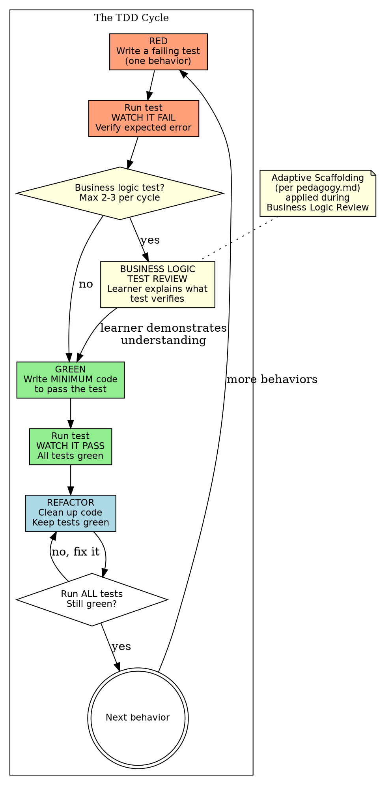

# Test-Driven Development

**Skill type: Rigid** -- Follow this process exactly. Do not skip phases. Do not shortcut the discipline. The red-green-refactor cycle IS the process.

## Overview

TDD is not a testing strategy. It is a design discipline. Writing the test first forces you to think about WHAT the code should do before thinking about HOW to do it. This produces cleaner interfaces, tighter contracts, and code that is testable by construction.

This skill enforces strict TDD discipline AND includes a business logic test review where the learner engages with the most important tests to build understanding of what the system protects.

## The Iron Law

```
NO PRODUCTION CODE WITHOUT A FAILING TEST FIRST
```

This is absolute. There are no exceptions. There are no "quick fixes." There are no "I'll add the test after." If production code exists without a test that demanded it, that code is unauthorized.

## The Three Laws of TDD

From Robert C. Martin:

1. **Write no production code except to pass a failing test.**
2. **Write only enough of a test to demonstrate a failure.**
3. **Write only enough production code to pass the test.**

These three laws create a tight feedback loop. Each cycle should be measured in minutes, not hours.

## When to Use

Auto-trigger on ANY of these:
- Implementing a new feature
- Fixing a bug
- Adding behavior to existing code
- Refactoring (tests first to lock behavior, then change structure)
- "Build X" / "Add Y" / "Fix Z" -- any task that produces production code

## Process Flow



## Phase 1: RED -- Write the Failing Test

Write a test for ONE behavior. Not two. Not "a few related ones." One.

### Steps

1. **Identify the next behavior to implement.** What should the code DO? Not how -- what.
2. **Write a test that asserts that behavior.** The test should be clear, specific, and test one thing.
3. **Run the test. Watch it fail.**
4. **Verify the failure is the RIGHT failure.** The test should fail because the behavior is missing, not because of a syntax error, import error, or misconfigured test. If the failure is wrong, fix the test -- not the production code.

### What "Watch It Fail" Means

You must:
- Actually run the test
- See the failure output
- Confirm the failure message matches what you expect

You must NOT:
- Assume it will fail
- Skip running it "because obviously it fails"
- Write multiple tests before running any

**If the test passes without new production code, something is wrong.** Either the behavior already exists (in which case you don't need to implement it) or the test is not testing what you think it's testing.

## Business Logic Test Review

After writing tests for a feature or task, identify the tests that cover core business logic -- the behaviors that matter most to the system's correctness from a domain perspective.

### What Qualifies as a Business Logic Test

**Include in review (max 2-3 per cycle):**
- Tests that verify core domain rules (e.g., "expired accounts cannot place orders")
- Tests that protect important invariants (e.g., "balance never goes negative")
- Tests that cover critical user-facing behavior (e.g., "cancelled subscription stops access immediately")
- Integration-level tests that verify workflows across module boundaries
- Tests that encode non-obvious business rules a future developer might accidentally break

**Skip for review (proceed normally through TDD):**
- Utility function tests (string formatting, data transformation helpers)
- Plumbing tests (serialization, configuration loading, route registration)
- Trivial accessor or constructor tests
- Tests that verify framework behavior rather than domain logic

### When to Trigger

- After writing tests during the RED phase for a feature/task
- Before moving to the GREEN phase for business-critical tests
- For non-critical tests (utility, plumbing), skip the review and proceed to GREEN normally

### How to Conduct the Review

Present the test code to the learner. Then ask:

**"In plain English, what does this test verify? What business rule does it protect?"**

Evaluate the learner's response:

| Response Quality | What It Looks Like | Action |
|---|---|---|
| **Accurate and complete** | Learner identifies the specific business rule, the scenario being tested, and why it matters | Acknowledge and move to GREEN |
| **Partially correct** | Learner gets the general idea but misses a key edge case or the specific business implication | Socratic probing: "What happens if [edge case]? Would this test catch that?" |
| **Surface-level only** | Learner describes WHAT the test does mechanically ("it checks that X returns Y") but not WHY it matters | "OK, but why does the system need this behavior? What goes wrong for the user if this test didn't exist?" |
| **Incorrect** | Learner misidentifies what the test protects | "Let's look at the assertion more carefully. What specific condition is being checked? What would make this assertion fail?" |

Apply the adaptive scaffolding ladder from `${CLAUDE_PLUGIN_ROOT}/references/pedagogy.md` when the learner struggles:

1. Pure Socratic: "What business scenario does this test represent?"
2. Narrowing: "Focus on the assertion -- what specific condition is it checking?"
3. Hint: "Think about what would happen to the user if this behavior were broken..."
4. Partial reveal: "This test protects the rule that [partial description]. What's the full picture?"
5. Explain fully, then verify: State the business rule, explain why it matters, then ask a follow-up to confirm understanding.

**Reset the ladder for each test under review.**

### For Advanced Learners

If appropriate for the learner's level, instead of presenting the test code:

1. Describe the behavior that needs testing in plain English
2. Ask the learner to write the test themselves
3. Compare their test to yours -- discuss differences in approach, coverage, and edge cases
4. This is the highest-value version of the review because the learner must reason about both the business rule AND the testing strategy

### Cap and Discipline

- **Maximum 2-3 tests per review cycle.** Do not overwhelm. Pick the ones that matter most.
- **Do not review every test.** The goal is to build business logic intuition, not to create a bottleneck.
- **Non-business tests skip this entirely.** Utility tests, plumbing tests, and trivial tests go straight through the normal TDD cycle.

## Phase 2: GREEN -- Write Minimum Code to Pass

Write the MINIMUM production code that makes the failing test pass.

### What "Minimum" Means

- If a constant makes the test pass, return a constant. Yes, really.
- If an `if` statement makes it pass, write the `if` statement. Don't write the elegant abstraction yet.
- If duplicating a line makes it pass, duplicate the line. Refactoring comes later.

**The GREEN phase is not the time for:**
- Elegant design
- Optimization
- Handling edge cases that don't have tests yet
- "While I'm here, let me also..."

### Steps

1. **Write the simplest code that makes the test pass.**
2. **Run the test. Watch it pass.**
3. **Run ALL tests. Verify nothing else broke.**

**If other tests broke, you introduced a regression.** Fix it before moving on. Do not proceed with broken tests.

## Phase 3: REFACTOR -- Clean Up While Green

With all tests passing, improve the code structure WITHOUT changing behavior.

### What Refactoring Means Here

- Remove duplication
- Improve naming
- Extract methods/functions for clarity
- Simplify conditionals
- Improve organization

### What Refactoring Does NOT Mean

- Adding new behavior (that requires a new test first)
- Optimizing for performance (that requires a benchmark first)
- "Improving" test code during production code refactoring (keep them separate)

### Steps

1. **Identify one improvement.**
2. **Make the change.**
3. **Run ALL tests. Still green?**
4. **If yes, repeat from step 1 or move to the next RED cycle.**
5. **If no, undo the change. Figure out why it broke. Try again.**

## Strict Enforcement

### Write Code Before the Test? Delete It. Start Over.

Not "let me keep it and write a test for it." Not "let me adapt the test to what I wrote." **Delete the production code. Write the test. Watch it fail. THEN write the production code.**

This is not punishment. This is the discipline that makes TDD work. The test must drive the code, not justify it.

### Delete Means Delete

- Do not keep the deleted code as a "reference"
- Do not paste it back after writing the test
- Do not "remember" it and write the same thing
- Write fresh code driven by the test. If the same code emerges, fine. But it must emerge FROM the test.

## Rationalization Table

If you catch yourself thinking any of these, you are rationalizing your way out of TDD:

| Rationalization | Why It's Wrong | What To Do |
|----------------|---------------|------------|
| "This is too simple to need a test" | Simple code is where hidden assumptions live | Write the test. It'll be fast. |
| "I'll add the test after" | After-the-fact tests confirm implementation, not behavior | Delete the code. Write the test first. |
| "Let me just write a few more tests before going green" | You're batching. Each test needs its own red-green cycle. | Stop. Go green on the current test. |
| "This refactoring needs new code" | If it needs new behavior, it needs a new test. It's not refactoring. | RED phase first. |
| "The test infrastructure isn't ready" | Then the first test is about the infrastructure. | Write a test for the infrastructure. |
| "I know what the code should look like" | TDD doesn't care what you know. It cares what the tests demand. | Write the test. Let it drive. |
| "These are just internal implementation details" | If the behavior matters, test it. If it doesn't, why are you writing it? | Either test it or don't write it. |
| "I'll refactor the tests later" | Test quality degrades silently. Refactor tests in the REFACTOR phase. | Clean up tests when refactoring. |
| "The learner doesn't need to understand this test" | If it tests business logic, they do. If it doesn't, fine to skip. | Check against the business logic test review criteria. |

## Red Flags

These signal TDD discipline is breaking down:

| Signal | Problem | Fix |
|--------|---------|-----|
| Test passes on first run | Test isn't testing new behavior | Verify the test actually requires new code |
| Multiple tests written before any GREEN | Batching, not TDD | Go green on one test at a time |
| GREEN phase produces "extra" code | Gold-plating the implementation | Delete the extra code. Write a test that demands it. |
| Refactoring changes behavior | That's not refactoring, that's feature creep | Undo. New behavior needs a new RED. |
| Tests only run at the end | Not getting the feedback loop | Run after every change |
| Test describes HOW, not WHAT | Implementation coupling | Rewrite the test to describe behavior |
| Learner can't explain what a business test protects | Gap in domain understanding | Business logic test review with scaffolding |

## Common Anti-Patterns

| Anti-Pattern | Description | Why It Fails |
|---|---|---|
| **Test-After Development** | Write code, then write tests to cover it | Tests mirror implementation, not behavior. Misses edge cases the code doesn't handle. |
| **Big Bang Testing** | Write all tests for a feature at once, then implement | Loses the design feedback from incremental test-first cycles. |
| **Testing the Mock** | Tests pass because mocks are configured to match the code | You're testing your assumptions, not the system. |
| **Fragile Tests** | Tests break when implementation changes but behavior doesn't | Tests are coupled to implementation, not behavior. |
| **Test-Per-Method** | One test class per production class, one test per method | Tests reflect code structure, not behavior. Misses interactions. |
| **Commenting Out Failing Tests** | "I'll fix it later" | You now have code without a safety net. Uncomment and fix. |

## Integration with Other Skills

- **`learning-mode:socratic-debugging`**: When a test fails unexpectedly during GREEN or REFACTOR, switch to socratic-debugging to understand why. Return to TDD after the root cause is understood.
- **`learning-mode:verification-before-completion`**: Before claiming a feature is complete, verify ALL tests pass with fresh output. Evidence before assertions.
- **`learning-mode:code-reviewer`** (agent): After completing a feature through TDD, dispatch the code-reviewer agent. The reviewer can evaluate both the tests and the production code.
- **`learning-mode:socratic-brainstorming`**: If TDD reveals that the design needs rethinking (tests are too painful to write, indicating a design smell), transition to brainstorming.

## Example Interaction Sketch

**Scenario:** Implementing an order discount feature. Orders over $100 get 10% off; orders over $500 get 20% off.

**RED:** Write a test: `order of $50 gets no discount`.
Run it. Fails: `applyDiscount is not defined`.

**RED (continued):** This is a non-business plumbing test (basic function existence). Skip business logic review. Proceed to GREEN.

**GREEN:** Define `applyDiscount` that returns the input amount.
Run it. Passes.

**RED:** Write a test: `order of $150 gets 10% discount, total is $135`.
Run it. Fails: `expected 135, got 150`.

**Business Logic Test Review:** This tests a core business rule -- the discount threshold.
Present the test to the learner: "In plain English, what does this test verify? What business rule does it protect?"
Learner: "It checks that orders over $100 get a 10% discount."
Claude: "Good. What would happen to the business if this rule were accidentally removed?"
Learner: "Customers would be charged full price when they should get a discount -- they'd be overcharged."
Claude: "Exactly. This test protects the pricing contract with customers. Let's proceed."

**GREEN:** Add the $100 threshold logic. Minimum code.
Run it. Passes.

**RED:** Write a test: `order of $600 gets 20% discount, total is $480`.
Run it. Fails: `expected 480, got 540` (applying 10% instead of 20%).

**Business Logic Test Review:** Another core business rule -- the higher discount tier.
Present to learner: "What does this test verify?"
Learner: "Orders over $500 get a bigger discount."
Claude: "What specific edge case distinguishes this from the previous rule? What would go wrong if we only had the first rule?"
Learner: "High-value customers would only get 10% instead of 20% -- we'd lose them to competitors with better volume discounts."
Claude: "Right -- this test protects the tiered pricing structure. Let's implement."

**GREEN:** Add the $500 threshold logic.
Run it. Passes. All tests pass.

**REFACTOR:** Clean up any duplication in the threshold logic.
Run all tests. Still green. Done with this cycle.
