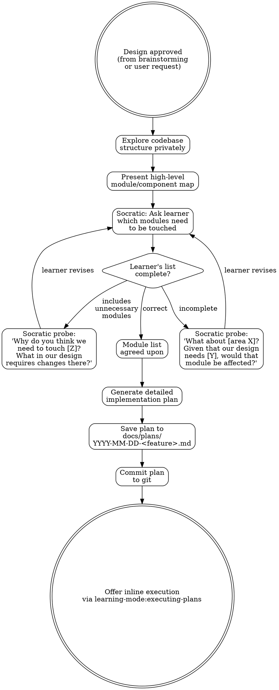

# Writing Implementation Plans

**Skill type: Flexible** -- Adapt the plan format and granularity to the project context. The principles (bite-sized tasks, TDD, exact paths, frequent commits) are non-negotiable; the presentation scales to complexity.

## Overview

Transform an approved design into a detailed, step-by-step implementation plan that assumes the executor has zero context. Every task is small enough to complete in 2-5 minutes. Every step is a single action. Every command includes expected output. Nothing is left to interpretation.

Before generating the plan, engage the learner in a Socratic module identification exercise to build codebase awareness at the macro level.

Refer to `${CLAUDE_PLUGIN_ROOT}/references/pedagogy.md` for the Socratic teaching stance used during module identification.

## Process Flow



## Checklist

You MUST create a task for each of these items and complete them in order:

1. **Explore the codebase** -- understand the project structure, tech stack, existing patterns
2. **Socratic module identification** -- present the module map, ask the learner which modules need to be touched, probe until the list is accurate
3. **Generate the plan** -- write detailed tasks with files, steps, commands, and expected output
4. **Save the plan** -- write to `docs/plans/YYYY-MM-DD-<feature-name>.md`
5. **Commit the plan** -- commit to git
6. **Offer execution** -- offer to execute the plan inline via `learning-mode:executing-plans`

## Phase 0: Socratic Module Identification

Before writing a single line of the plan, build the learner's codebase awareness.

### Step 1: Private Exploration

Explore the codebase structure silently. Understand which modules, components, layers, and files are relevant to the approved design. Build a mental map of what needs to change and where.

### Step 2: Present the Module Map

Present the high-level module/component map of the relevant parts of the codebase. Keep it at the architectural level -- directories, modules, layers, services. Not individual files.

Example: "Here's how the relevant parts of the codebase are organized: [module A] handles X, [module B] handles Y, [module C] handles Z. They interact through [description of interfaces/data flow]."

### Step 3: Ask the Learner

Ask: **"Based on our design, which of these modules do you think we'll need to touch or add to?"**

Wait for their answer. Do NOT generate the plan yet.

### Step 4: Evaluate and Probe

Compare their list to what you know from your private exploration.

**If their list is incomplete** (missing modules that need changes):
- "What about [area X]? Given that our design needs [feature Y], would that module be affected?"
- "Where does [data/event/request] flow after it leaves [module they mentioned]? Would anything downstream need to change?"
- "Our design includes [aspect Z] -- where in the codebase would that live?"

**If their list includes unnecessary modules:**
- "Why do you think we need to touch [module Z]? What in our design requires changes there?"
- "What specific change would you make in [module Z]? Is that actually needed for what we're building?"

**If their list is correct:**
- Acknowledge it: "That's a solid read of the codebase. You've identified the right areas."
- Optionally probe WHY for one or two to verify understanding: "What specifically about [module X] needs to change for our design?"

Apply the adaptive scaffolding ladder from `${CLAUDE_PLUGIN_ROOT}/references/pedagogy.md` if the learner struggles. The ladder resets for each module they're missing or misidentifying.

### Step 5: Agree on the Module List

Once the learner has identified all the right modules (with scaffolding as needed), confirm the agreed-upon list. This becomes the scope for the plan.

**Then and only then, generate the detailed plan.**

## Phase 1: Plan Header

Every plan starts with a header that orients the reader:

```markdown
# Implementation Plan: <Feature Name>

**Date:** YYYY-MM-DD
**Goal:** <One sentence describing what we're building and why>
**Design doc:** <Link to design doc if one exists, or "N/A">

## Architecture Context

<Brief description of relevant modules and how they interact.
Include only what's needed to understand the plan.>

## Tech Stack

<Languages, frameworks, libraries relevant to this plan>

## Modules Affected

<The agreed-upon list from Socratic module identification>
- **module-a**: <what changes and why>
- **module-b**: <what changes and why>
- ...
```

## Phase 2: Task Structure

Break the implementation into bite-sized tasks. Each task is 2-5 minutes of work.

### Task Format

```markdown
### Task N: <Short descriptive title>

**Goal:** <What this task accomplishes>
**Files:**
- `path/to/file.ts` (modify | create | delete)
- `path/to/test.ts` (create)

**Steps:**

1. <Single action — e.g., "Create the file `path/to/file.ts` with the following skeleton:">

   ```typescript
   // exact code or clear description of what to write
   ```

2. <Next single action — e.g., "Write the failing test in `path/to/test.ts`:">

   ```typescript
   // exact test code
   ```

3. <Run command with expected output>

   ```bash
   npm test -- --grep "widget"
   ```

   **Expected:** Test fails with "Cannot find module './widget'"

4. <Next action...>

**Commit:** `feat: add widget skeleton and failing test`
```

### Task Rules

- **One action per step.** "Write the failing test" is a step. "Run it to see it fail" is the next step. Never combine them.
- **Exact file paths.** Always absolute from project root. Never "the config file" -- say `src/config/database.ts`.
- **Exact commands.** Include the full command, not "run the tests." Say `npm test -- --grep "widget service"`.
- **Expected output.** After every command, state what the executor should see. This is how they know the step worked.
- **TDD cadence.** For any logic: write failing test, run it (confirm red), write implementation, run it (confirm green). Reference `learning-mode:test-driven-development` for the full TDD discipline.
- **Frequent commits.** Commit after every task, sometimes mid-task for natural breakpoints. Include the exact commit message.
- **DRY.** If two tasks share setup, extract it into an earlier task. Never duplicate work.
- **YAGNI.** If a step isn't needed for the current feature, cut it. No "while we're here" additions.

## Phase 3: Save and Offer Execution

### Save the Plan

Write the completed plan to:

```
docs/plans/YYYY-MM-DD-<feature-name>.md
```

Use today's date and a kebab-case feature name. Example: `docs/plans/2026-03-02-user-authentication.md`

Commit the plan to git:

```bash
git add docs/plans/YYYY-MM-DD-<feature-name>.md
git commit -m "docs: add implementation plan for <feature-name>"
```

### Offer Execution

After saving and committing the plan, offer to execute it:

"The plan is saved and committed. Would you like me to start executing it? I'll work through each task step by step, using `learning-mode:executing-plans`."

Invoke `learning-mode:executing-plans` if the learner agrees.

## Principles

| Principle | What It Means in Practice |
|-----------|--------------------------|
| **Zero context assumed** | Someone reading only the plan can execute it without asking questions |
| **Bite-sized tasks** | 2-5 minutes each. If a task takes longer, split it. |
| **One action per step** | Write code OR run a command OR verify output. Never two at once. |
| **Exact paths and commands** | No ambiguity. No "the relevant file." Full paths, full commands. |
| **TDD always** | Red-green-refactor for every piece of logic. Reference `learning-mode:test-driven-development`. |
| **Frequent commits** | After every task. Exact commit messages in the plan. |
| **DRY** | No duplicated work across tasks. |
| **YAGNI** | Nothing speculative. Only what the design requires. |

## Red Flags

| Thought | Reality | Instead |
|---------|---------|---------|
| "This step is obvious, I don't need to spell it out" | Obvious to you. The executor has zero context. | Spell it out. Include the command, the path, the expected output. |
| "I'll combine these two steps to keep the plan shorter" | Short plans with combined steps cause confusion. Long plans with atomic steps are clear. | One action per step. Always. |
| "They probably know which file I mean" | Maybe. Maybe not. Ambiguity wastes time. | Full path from project root. Every time. |
| "Testing this isn't worth a separate step" | Untested steps are unverified steps. | TDD. Red then green. |
| "I'll add this extra feature while we're here" | YAGNI. Scope creep starts with "while we're here." | Cut it. If it matters, it gets its own plan. |
| "Let me skip module identification, I know what needs to change" | The learner doesn't. Module identification builds the codebase awareness they need. | Always do Phase 0. It's fast when the learner knows the codebase. |

## Integration with Other Skills

- **`learning-mode:socratic-brainstorming`**: Typically invokes this skill after Phase A design is approved. The design doc feeds into this plan.
- **`learning-mode:executing-plans`**: Executes the plan this skill generates. Offer inline execution after saving.
- **`learning-mode:test-driven-development`**: Referenced in TDD steps within the plan. The executing skill uses it during implementation.
- **`learning-mode:verification-before-completion`**: Applied during execution to verify each task is actually complete.
